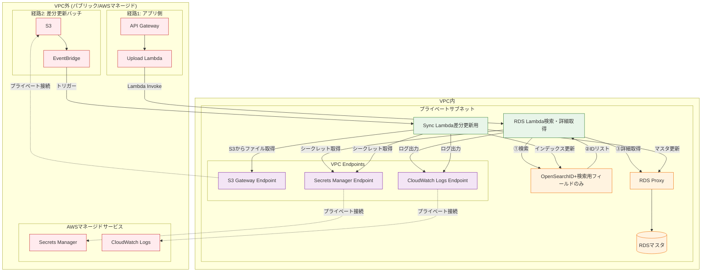

### Tech0 アーキテクチャ

#### アーキテクチャ図

- データ連携部分に関して、OpenSearch（やAurora）であるかはFIX前である
  

#### リソース一覧

監査対象とするAWSリソースの一覧です。

#### ネットワーク・セキュリティ

| カテゴリ         | リソース名       | 用途・備考                         |
| ---------------- | ---------------- | ---------------------------------- |
| CDN              | CloudFront       | コンテンツ配信                     |
| DNS              | Route53          | ドメイン管理                       |
| ファイアウォール | WAF              | フロント用（CloudFront前段）       |
| ファイアウォール | WAF              | API用（API Gateway前段）           |
| VPC              | VPC              | メインVPC（CIDR: 172.16.160.0/24） |
| VPC              | VPC              | データ連携用VPC                    |
| サブネット       | Public subnet    | ALB、NAT GW配置                    |
| サブネット       | Private subnet   | ECS/Fargate配置                    |
| サブネット       | Private subnet   | RDS、Lambda配置（データ連携用）    |
| ゲートウェイ     | Internet Gateway | インターネット接続                 |
| ゲートウェイ     | NAT Gateway      | プライベートサブネット外部通信     |
| ロードバランサー | ALB              | アプリケーションロードバランサー   |
| エンドポイント   | VPC Endpoint     | AWSサービスへのプライベート接続    |

#### コンピューティング

| カテゴリ           | リソース名            | 用途・備考                                      |
| ------------------ | --------------------- | ----------------------------------------------- |
| コンテナ           | ECS                   | コンテナオーケストレーション                    |
| コンテナ           | Fargate               | サーバーレスコンテナ実行（Next.js）             |
| コンテナレジストリ | ECR                   | コンテナイメージ管理                            |
| スケーリング       | AutoScaling           | Fargate自動スケーリング                         |
| サーバーレス       | Upload Lambda         | API Gateway経由のリクエスト処理（VPC外）        |
| サーバーレス       | RDS Lambda            | OpenSearch検索・RDS詳細取得（VPC内）            |
| サーバーレス       | Sync Lambda           | S3差分ファイル取得・RDS/OpenSearch更新（VPC内） |
| サーバーレス       | Tavily&Bedrock Lambda | Bedrock連携・検索API呼び出し                    |
| 接続管理           | RDS Proxy             | RDSへの接続プール管理                           |

#### ストレージ・データベース

| カテゴリ               | リソース名 | 用途・備考                           |
| ---------------------- | ---------- | ------------------------------------ |
| オブジェクトストレージ | S3         | アプリケーションデータ用             |
| オブジェクトストレージ | S3         | CSV出力用（DataHub連携）             |
| NoSQL                  | DynamoDB   | アプリケーションデータ               |
| RDB                    | RDS        | SFDCデータ格納                       |
| 検索エンジン           | OpenSearch | 全文検索・ログ分析（導入可能性あり） |

#### AI・機械学習

| カテゴリ | リソース名 | 用途・備考                    |
| -------- | ---------- | ----------------------------- |
| 生成AI   | Bedrock    | AI/LLM機能（runtime/SDK経由） |

#### 統合・メッセージング

| カテゴリ         | リソース名  | 用途・備考                    |
| ---------------- | ----------- | ----------------------------- |
| API管理          | API Gateway | REST API公開                  |
| メッセージキュー | SQS         | 非同期処理                    |
| イベント管理     | EventBridge | スケジュール/イベント駆動処理 |

#### 運用・監視・セキュリティ

| カテゴリ         | リソース名      | 用途・備考                 |
| ---------------- | --------------- | -------------------------- |
| 監視             | CloudWatch      | メトリクス・ログ監視       |
| 監査             | CloudTrail      | API操作ログ                |
| セキュリティ統合 | Security Hub    | セキュリティ状況の一元管理 |
| 脆弱性検査       | Inspector       | 脆弱性スキャン             |
| 脅威検出         | GuardDuty       | 脅威検出                   |
| 構成管理         | Systems Manager | パラメータストア等         |

---

#### VPC内リソースとVPCエンドポイントの関係

Private subnet内のリソースがAWSサービスにアクセスする際、VPCエンドポイント経由の通信はネットワークアクティビティイベントの対象となります。

**VPC内に配置されるリソース:**

| リソース    | 配置場所       | 役割                                                 |
| ----------- | -------------- | ---------------------------------------------------- |
| ECS/Fargate | Private subnet | Next.jsアプリケーション実行                          |
| RDS Lambda  | Private subnet | OpenSearch検索 → RDS詳細取得                         |
| Sync Lambda | Private subnet | S3差分ファイル取得 → RDS/OpenSearch更新              |
| RDS Proxy   | Private subnet | RDSへの接続プール管理                                |
| RDS         | Private subnet | マスタデータ格納（SFDC）                             |
| OpenSearch  | Private subnet | ID＋検索用フィールドのインデックス（導入可能性あり） |

**今回のアーキテクチャで必要なVPCエンドポイント:**

| AWSサービス     | エンドポイントタイプ | 利用元リソース          | 用途             |
| --------------- | :------------------: | ----------------------- | ---------------- |
| S3              |       Gateway        | Sync Lambda             | 差分ファイル取得 |
| Secrets Manager |      Interface       | RDS Lambda, Sync Lambda | DB接続情報取得   |
| CloudWatch Logs |      Interface       | RDS Lambda, Sync Lambda | ログ送信         |

**RDS周りのアーキテクチャ:**

**通信経路とVPCエンドポイントの利用:**

| 経路  | 通信フロー                    | 経由                                   |
| ----- | ----------------------------- | -------------------------------------- |
| 経路1 | Upload Lambda → RDS Lambda    | Lambdaサービス内部（AWS管理）          |
| 経路1 | RDS Lambda → OpenSearch       | VPC内直接通信                          |
| 経路1 | RDS Lambda → Secrets Manager  | **Secrets Manager Interface Endpoint** |
| 経路1 | RDS Lambda → RDS Proxy → RDS  | VPC内直接通信                          |
| 経路1 | RDS Lambda → CloudWatch Logs  | **CloudWatch Logs Interface Endpoint** |
| 経路2 | Sync Lambda → S3              | **S3 Gateway Endpoint**                |
| 経路2 | Sync Lambda → Secrets Manager | **Secrets Manager Interface Endpoint** |
| 経路2 | Sync Lambda → RDS Proxy → RDS | VPC内直接通信                          |
| 経路2 | Sync Lambda → OpenSearch      | VPC内直接通信                          |
| 経路2 | Sync Lambda → CloudWatch Logs | **CloudWatch Logs Interface Endpoint** |
